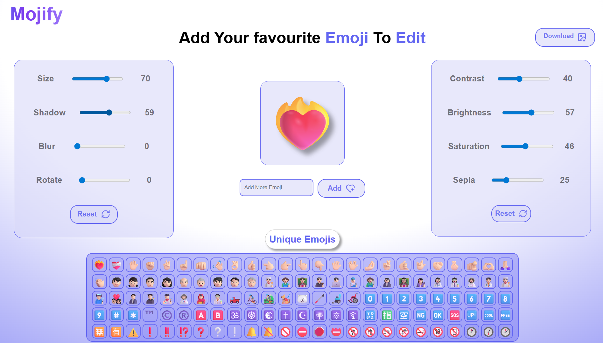
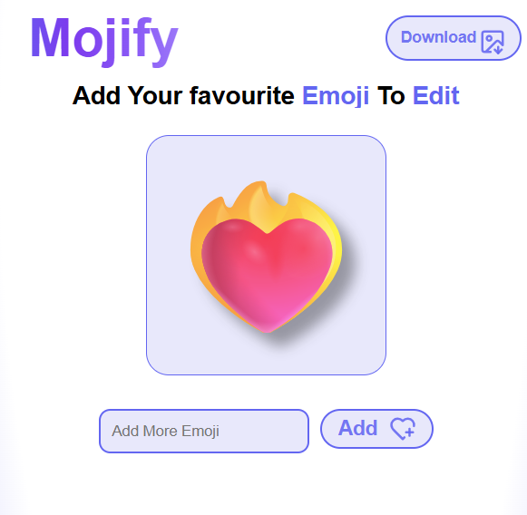
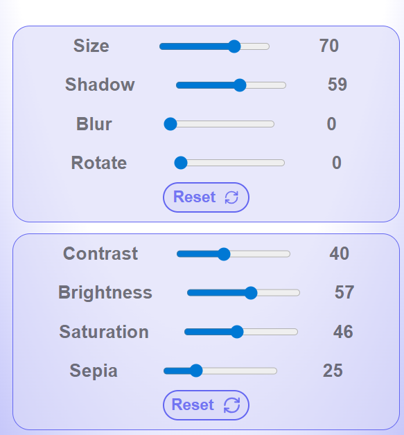
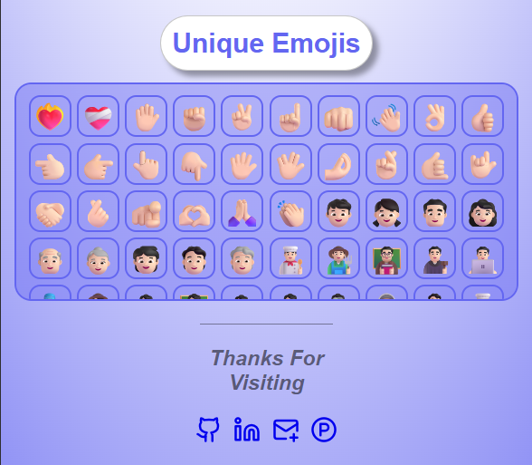

# 🛠️ Modify — Emoji Editor App


A modern, interactive emoji editor that lets you select, customize, and download emojis with ease. Whether you're designing content for social media, building 3D-ready assets, or just having fun, **Modify** empowers you to bring emojis to life!

🔗 **Live Site:** [emoji-editor-wa1s.vercel.app](https://emoji-editor-wa1s.vercel.app/)

---

## ✨ Features

- 🎨 **Categorized Emoji Picker** — Choose from a wide range of emojis, neatly grouped by theme
- ✏️ **Emoji Customizer** — Resize, reposition, and rotate emojis to your liking
- 💾 **Download as Image** — Export your edited emoji in high-quality format
- 🔄 **Reset with Confirmation** — Easily revert to the original state with a toast-based confirmation
- 📱 **Responsive UI** — Fully optimized for desktop and mobile devices
- 🧠 **Minimal & Intuitive Interface** — Clean layout with toast notifications for user actions

---

## 🖼️ Screenshots






---

## 🚀 Getting Started

### 🔧 Installation

1. **Clone the repository**
   ```bash
   git clone https://github.com/your-username/emoji-editor.git
   cd emoji-editor
